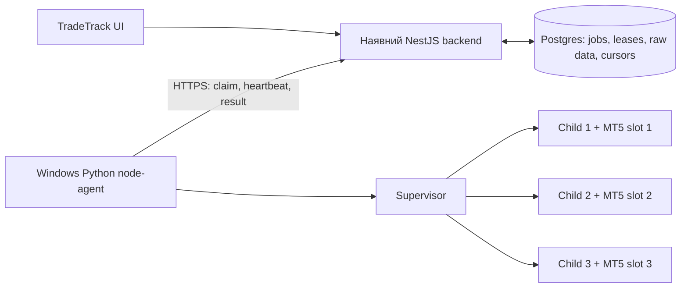

**План модернізації Python MT5 collector — 10 вересня 2026**

Поточне доповнення: реалізовано локальний [shadow queue/worker](queue-worker.uk.md)
із jobs/leases, raw persistence і account balance/equity/currency. Живий demo дав
5 raw deals і 2 закриття. Пункти старих status-звітів нижче описують попередні
етапи, а не поточну готовність. Canonical journal, широке broker/investor підтвердження
та production/VPS rollout ще не завершені.

Базовий код: `89f518042bfd56e5ade707f512c0e0681081c911`. Робоча гілка: `improvement/mt5-collector-core`. Документ описує цільову систему; статус реалізації наведено наприкінці. Наявність пункту в плані не означає, що він уже працює.

**1. Узгоджені вимоги**

Інвесторський доступ, імпорт історії й оновлення відкритих позицій приблизно кожні 5 хвилин. Жодного виконання торгових операцій. Орієнтир — 100 користувачів, у розрахунках 100–150 рахунків. Windows VPS — $20–25/місяць, без вартості вже наявного бекенду/БД. Спочатку локальні тести, потім реальний MT5, потім VPS. MT5 у користувача встановлений, окремий тестовий рахунок він підготує пізніше.

Мета інтервалу — свіжість даних, а не лише запуск cron раз на 5 хвилин. Початковий великий імпорт має окремий статус і бюджет, щоб не затримувати регулярні синки інших рахунків. Гарантувати місткість VPS до вимірювань неможливо.

**2. Що змінюємо в поточній реалізації**

| Зараз | Рішення |
| --- | --- |
| Прямі FastAPI-запити й RQ можуть працювати зі спільною MT5-сесією | Один активний child-процес на один terminal slot; усі команди тільки через supervisor |
| Перевіряється login, але не точний server | Перевіряти login + server після авторизації та навколо читання даних; при зміні контексту відкидати весь результат |
| Останній deal замінює всю позицію | Передавати всі raw deals; агрегування життєвого циклу позиції — в одному модулі бекенду |
| `history_deals_get() == None` стає успішним `[]` | Помилка окремо від порожньої вибірки; курсор і snapshot при помилці не рухаються |
| Discovery повторно запускає термінал із паролем у CLI | Окремий provisioning перевірених серверів; пароль не передавати в аргументах процесу |
| Python hash визначає чергу, пароль лежить в RQ arguments | Durable jobs з account lease, credential reference і версією; affinity лише підказка |
| Thread timeout не гарантує переривання native IPC | Зовнішній process watchdog, контроль власних PID та дерева процесів |
| restart.ps1 завершує всі python.exe | Керувати лише процесами конкретної інсталяції/slot |
| Публічні маршрути без авторизації, raw traceback у відповіді | Backend авторизує користувача; Windows використовує вихідний автентифікований HTTPS |

В офлайн-відтворенні старого коду часткові закриття з прибутком 100 дали 60, комісії −4 стали −1.2, напрямок BUY перетворився на SELL. Також підтверджено прийняття іншого server при однаковому login і підміну помилки історії порожньою відповіддю. Це синтетичні перевірки, а не результати на живих рахунках.

**3. Архітектура та межі відповідальності**

Python відповідає за ізоляцію MT5, авторизацію рахунку, безпечне читання, нормалізацію сирих результатів, обмеження ресурсів і доставлення результатів. NestJS відповідає за власника рахунку, шифровані credentials, розклад, durable queue, повтори, збереження, дедуплікацію та побудову торгового журналу. Windows не отримує прямі доступи до production Postgres.

Новий агент забирає завдання через вихідний HTTPS. Публічний Python API й Redis на Windows не потрібні. За потреби diagnostic API слухає лише loopback і не приймає паролі. Новий collector не підміняє старі endpoints до готовності backend-контракту; старий сервер не запускати як нову production-версію.

Структура Python: `collector/contracts.py` — типи; `collector/normalization.py` — raw data; далі `gateway.py` — вузький адаптер MetaTrader5, `session.py` — guards, `supervisor.py` — процеси, `agent.py`/`transport.py` — протокол бекенду, `catalogue.py` — provisioning, `config.py`, `telemetry.py`. Бібліотеку MT5 імпортує лише gateway всередині child; offline tests її не запускають.

**4. Контракт завдання і результату**

Уточнення живим тестом: raw MT5 time_msc не можна автоматично трактувати як UTC instant. [Перевірка історії](history-clock-and-attach-2026-09-10.uk.md) підтвердила пропуск поточних deals при верхній межі UTC-now. UTC використовується для часу спостереження/leases; raw broker timestamps зберігаються окремо, із зазначенням time basis. Перетворення історії в UTC потребує перевірених timezone/DST rules сервера. До цього UTC-курсор за padded native-вікном не рухається.

Команди першої версії: `verify_account`, `sync_recent`, `backfill_chunk`. Немає довільних команд, шляхів до exe чи торгових функцій із запиту. Конфігурація slot береться лише з локального перевіреного config.

Job envelope: `schema_version`, `job_id`, `account_id`, `credential_version`, `lease_id`, монотонний `fence`, `kind`, `[from_ms, to_ms)`, `deadline`, ліміти. Tenant/account binding визначає backend за автентифікованим користувачем, не довіряючи довільному `user_id` з браузера. Credential видається авторизованому node під чинну lease і не зберігається в job JSON.

Result envelope: ті самі ідентифікатори й версії, `attempt_id`, перевірена account identity, terminal build, час спостереження історії/позицій, виконане вікно, raw deals, positions snapshot із прапорцем повноти, машинний код помилки. Дані різних викликів MT5 не є атомарним знімком брокера; час кожного спостереження зберігається окремо.

MT5 tickets/login/order/position IDs у JSON — десяткові рядки, щоб не втратити 64-бітну точність у JavaScript. Грошові значення/ціни/обсяги — десяткові рядки без округлення до двох знаків. Це зберігає отримане значення; не відновлює точність, уже втрачену в MT5 double. Дати — UTC з мілісекундами. Naive datetime, нечислові/нескінченні значення та мовчазна втрата полів заборонені. Некоректний запис відхиляє batch з контрольованою помилкою.

Raw deal зберігає ticket, order, position_id, type, entry, time_msc, volume, price, profit, commission, swap, fee, symbol, magic, reason. Type й entry зберігаються числами, включно з невідомими майбутніми enum: backend позначає непідтриману семантику, а не викидає запис. Коментарі й external_id не потрібні для першої моделі журналу та не експортуються за замовчуванням; це вибраний набір полів, а не побайтовий архів усіх даних MT5.

Positions зберігають окремо ticket та identifier, тип, volume, price_open/current, profit, swap, SL/TP, time_msc/update_msc, symbol, magic, reason. Snapshot застосовується повністю й лише після перевірки identity/lease. `None` або неповна відповідь не означають «усі позиції закриті». Зникла позиція потребує історії для остаточної закритої угоди; нотатки/теги користувача не видаляти.

**5. Авторизація та investor-only: блокувальна перевірка пілота**

Кожна робота передає явні path/login/password/server і `portable=True`; жодного fallback на останній збережений рахунок/пароль. Після initialize виконується явна авторизація й звірка account identity. Server зіставляється з точним перевіреним endpoint каталогу, без fuzzy matching; alias допустимий лише після окремого підтвердження.

`account_info.trade_allowed=True` — відхилення. `False` — лише додатковий сигнал: він може описувати обмежений master-account. Документований Python API не надає окремого прапорця типу введеного пароля. Тому прийняти False як достатній доказ investor-only не можна. [Account properties](https://www.mql5.com/en/docs/constants/environment_state/accountinformation), [правила авторизації](https://www.metatrader5.com/en/terminal/help/startworking/authorization).

Перед live-пілотом перевірити на відомих demo investor/master credentials, чи можна отримувати підтвердження саме свіжої investor-сесії, зокрема з журналу термінала. Запис журналу має бути після початку спроби, відповідати login/server та поточному процесу; старий рядок, інша мова/build, ротація або неоднозначність дають `INVESTOR_MODE_UNVERIFIED`. Неперевірений parser журналу не є готовим рішенням. Не виконувати торгові проби; не вимагати production master password. Якщо надійний сигнал недоступний, investor-only залишається заблокованою вимогою; послаблення можливе лише після окремого обговорення з користувачем.

Додатково вимкнути trading через зовнішній Python API, перевіряти `terminal_info.tradeapi_disabled`, connected, path/data_path; вимкнути EA/DLL і використовувати чисті профілі. Це окремий захисний шар, а не доказ типу пароля. [Terminal info](https://www.mql5.com/en/docs/python_metatrader5/mt5terminalinfo_py), [налаштування автоматичної торгівлі](https://www.metatrader5.com/en/terminal/help/algotrading/trade_robots_indicators).

**6. Життєвий цикл terminal slot**

Стан slot: `stopped → starting → ready → busy → cleaning → ready`; збої — `restarting`, повторні — `quarantined`. Один exe/data directory, ексклюзивний OS-lock і максимум один власник MT5 IPC на slot. Різні Python threads не забезпечують цю ізоляцію.

Початково 1 slot локально, потім 2–3, на VPS 3 і четвертий тільки після вимірювань. Каталоги поза Program Files, наприклад `C:\TradeTrack\terminals\slot-01`, з ACL службового користувача. Кожен slot має власні profiles/config/cache. Не копіювати accounts.dat та авторизовані профілі між клієнтами. Прив'язка рахунку до slot зменшує холодні старти, але не блокує перенесення при його відмові.

Послідовність job: claim → перевірка deadline/config → ексклюзивний slot → отримання credential → створення child → явний login → guards → history → guards → positions → guards → нормалізація → shutdown → передача результату → підтвердження backend → звільнення lease. Heartbeat виконує supervisor незалежно від завислого child. Для verify_account історію не читати.

Watchdog має жорсткий wall-clock timeout, завершення child і належного йому terminal tree, перевірку exit, очищення IPC та перезапуск slot. Windows Job Object/аналог перевірити на реальному автозапуску MT5: бібліотека може приєднатися до існуючого процесу. Якщо ownership не доведений, не вбивати чужий процес — quarantine. `shutdown()` не гарантує вихід terminal.exe. Після примусового завершення не використовувати стару multiprocessing Queue; створити новий обмежений канал. [Multiprocessing](https://docs.python.org/3/library/multiprocessing.html).

Child передає тільки дозволений JSON/result, без pickle з мережі. Обмежити розмір IPC/HTTP payload та runtime до накопичення великих даних. Якщо очищення не завершилося, наступний клієнт не використовує slot. Recycling після заданої кількості jobs/росту RAM; значення визначити soak-тестом. Оновлення MT5 — drain одного slot, перевірка build, canary, потім решта.

**7. Історія, позиції та правильний журнал**

Не зводити історію до останнього deal. Entry IN/OUT/INOUT/OUT_BY, partial fill, partial close, netting reversal, hedging/close-by мають різну семантику. Напрямок exit deal не дорівнює напрямку позиції. Opening commissions, exit commissions, swap і fee не можна губити. Balance/credit/commission/correction операції зберігати окремо від торгового P&L. [Deal properties](https://www.mql5.com/en/docs/constants/tradingconstants/dealproperties).

Один canonical reducer у бекенді відтворює позиції з raw deals. Для netting reversal одного position_id недостатньо для поділу торгових циклів: reducer сегментує їх і визначає розподіл витрат з перевірюваними правилами. Якщо opening deal поза завантаженим вікном, довантажити історію за position_id із лімітом або позначити неповноту; не вигадувати time_open. Перед інтеграцією перевірити чинні `mt5-deals.ts` і `mt5-open-positions.ts`, особливо scope account та збереження користувацьких полів.

Перший імпорт: свіжий стан і недавнє вікно, далі backfill чанками з найновіших до старих. Початкове обмеження job — 31 доба, response — 50 000 records; це конфігураційні стартові ліміти, не можливості MT5. Перевищення → менші вікна; навіть найменше вікно завелике → явна помилка й окремий шлях підтримки, жодного обрізання.

Внутрішні вікна `[from_ms,to_ms)`, брокерський запит розширюється до меж секунд, результат фільтрується по time_msc. Сортування `(time_msc,ticket)` для стабільності; дедуплікація за ticket у межах account/server identity. Однакові дублікати в batch можна прибрати, конфліктні — відхилити й повторно прочитати. Між синками upsert має дозволяти корекцію вже відомого ticket, а не лише INSERT IGNORE.

Cursor рухається лише після транзакційного збереження всього підтвердженого вікна. Регулярний overlap спочатку 24 години, фонове звіряння 30 днів раз на добу; це робочі припущення, переглянути за вартістю й поведінкою брокерів. Давні виправлення можуть лежати за будь-яким скінченним overlap: потрібна ручна повна resync та періодична ширша reconciliation. Чесно показувати неповний backfill і недоступність старої історії брокера.

Порожній tuple після успішного виклику — валідна вибірка цього запиту; це не доказ, що термінал завантажив усю доступну історію після холодного login. Перевірити стабілізацію на live, виконувати повторне звіряння та не оголошувати весь backfill завершеним без перевірок покриття. `None` — помилка. [History API](https://www.mql5.com/en/docs/python_metatrader5/mt5historydealsget_py), [Positions API](https://www.mql5.com/en/docs/python_metatrader5/mt5positionsget_py).

**8. Черга, п'ятихвилинний розклад і доставка**

Postgres jobs: `queued/running/retry_wait/succeeded/failed/cancelled`, available_at, attempt, lease expiry, fencing counter; атомарний claim зі SKIP LOCKED та окремим account serialization. Транзакції короткі, без MT5-викликів усередині. [Postgres SELECT](https://www.postgresql.org/docs/current/sql-select.html).

Один account має максимум одну активну роботу; повторний ручний sync приєднується до чинної. Одна due-job на account, jitter по всіх рахунках; після downtime не генерувати десятки прострочених jobs. Recent sync має пріоритет, backfill виконується малими квотами з захистом від голодування. Планувальник не запускається тільки при відкритті сторінки користувачем.

Delivery — at-least-once з ідемпотентним commit, а не обіцянка exactly-once. Result commit перевіряє account, lease, fence, credential_version і active state в тій самій транзакції, що raw data/cursor. Повтор від того самого attempt після втрати ACK повертає вже закомічений outcome. Result старої lease не може перезаписати новіший snapshot. Зміна пароля/видалення account/відкликання node скасовують старі jobs та відхиляють запізнілі результати.

При розриві backend-з'єднання агент припиняє claim, має обмежений backoff і не подовжує lease самостійно. До ACK тримає результат у межах ліміту; після crash повторне читання безпечне. Дисковий spool не потрібний у v1: він створює ще одне сховище фінансових даних. Якщо його додамо — шифрування, TTL і контроль розміру обов'язкові.

**9. Каталог брокерів і server discovery**

Нове підтверджене джерело: [MTAPI directory research](broker-directory-research.uk.md). Для пошуку компаній/серверів без credentials уже є перевірений незалежний HTTP adapter; GUI тепер резервний шлях. Production ліцензія/квоти та реєстрація результату в desktop slots ще не підтверджені.

Уточнений механізм автоматичного додавання для кількох терміналів: [пошук, перевірка і поетапне оновлення каталогу](server-provisioning.uk.md). Перенесення `servers.dat` поки є кандидатом для перевірки, а не готовим підтримуваним API.

Джерело першого списку — попередні агреговані SELECT: 44 точні server names у 78 typed MT5 accounts із заповненим сервером. Це спостережені назви, не доказ працездатності. За сукупністю попиту першими перевіряємо FundedNext, Exness, FTMO, The5ers, FundingPips; далі Goat/ACG/Headway/Octa. Конфліктні Blueberry → Goat та неоднозначні aliases потребують уточнення.

Сутності: broker/prop firm, broker operator, exact server, aliases, environment, terminal distribution, supported build, verification status/date. Фірма може мати кілька live/demo серверів і змінити оператора. Назва пропфірми не є адресою MT5, а один login не дозволяє однозначно знайти сервер.

UI: пошук фірми/сервера, список перевірених варіантів і коротке пояснення, де взяти точну назву. Збережений server пропонується повторно. «Мого сервера немає» створює bounded onboarding запит, а не нескінченне перебирання credentials по всіх брокерах. Автопідбір можливий тільки серед перевірених endpoint конкретного брокера з обмеженням спроб.

Provisioning окремо від звичайного sync: офіційний broker terminal або перевірений пошук компанії в MT5, probe готовності, тест login, каталог версій. Не обіцяти універсальний Python discovery API: його не знайдено в офіційній документації. Старі `/password` і `/server` не використовувати як документовані CLI switches. [Startup](https://www.metatrader5.com/en/terminal/help/start_advanced/start), [company search](https://www.metatrader5.com/en/terminal/help/startworking/acc_open).

**10. Помилки та реакція**

| Сценарій | Реакція |
| --- | --- |
| Невірні credentials / investor не підтверджено | Зупинити автоматичні повтори цього credential_version; зрозумілий статус і дія користувача |
| Server не provisioned / неоднозначний alias | Каталог/onboarding; не повідомляти «неправильний пароль» без доказу |
| Native IPC timeout / child crash | Завершити власний slot, відновити процеси, bounded retry іншою спробою |
| Broker/network unavailable | Exponential backoff + jitter, broker/node circuit breaker; решта брокерів продовжують |
| account_info/positions/history повертає None | Зняти last_error одразу; жодного успішного порожнього snapshot |
| Змінився login/server/path/права між викликами | Відкинути результат, quarantine при підозрі на перехресну сесію |
| Завеликий batch / invalid record | Не обрізати; зменшити вікно або явна non-success помилка |
| Втрата ACK / повторна доставка | Idempotent backend commit, без дублювання угод |
| Lease expired / credentials revoked | Скасувати job, очистити slot; старий результат відхилити |
| Disk full / RAM pressure / невдала ротація | Припинити claim, readiness=false, алерт; не перезапускати нескінченно |
| Windows reboot / RDP disconnect / MT5 auto-update | Відновлення без активної RDP-сесії має бути перевірене на live до запуску |

Native codes класифікувати за документованим значенням, текст — лише sanitized diagnostics. Деякі помилки не розрізняють усі причини; повертати `CONNECTION_FAILED` з correlation ID замість вигаданого точного діагнозу. HTTP не повертає traceback, пароль або сирий брокерський рядок. [Last error](https://www.mql5.com/en/docs/python_metatrader5/mt5lasterror_py).

**11. Секрети, експлуатація та VPS**

Паролі шифруються на backend окремим ключем, не потрапляють у jobs, JSON-логи, exception text, CLI, git або тестові fixtures. Node має відкличну окрему автентифікацію, дозволені типи jobs, ротацію токена, TLS з перевіркою сертифіката. Доступ до status/result завжди перевіряє власника. У Python неможливо обіцяти гарантоване занулення всіх копій рядка; зменшувати час життя секретів і не робити зайвих копій.

MT5 може кешувати облікові дані: ACL, чисті profiles, контроль конфігурації та перевірка артефактів після logout. `shutdown` і `KeepPrivate=0` самі по собі не доводять відсутність кешів. Terminal directories, dumps та journal не потрапляють у звичайні резервні копії. Резервувати конфігурацію без секретів і durable backend data; restore перевіряти практично.

На Windows — окремий обмежений обліковий запис, firewall, RDP через дозволені IP/VPN, вихідний HTTPS, синхронізація часу, контроль Defender/quarantine та диска. Вибір Windows Service/Task Scheduler — після перевірки MT5 у неінтерактивній сесії: не припускати працездатність GUI/IPC у Session 0. Обов'язкові reboot і RDP sign-out тести. Не вимикати UAC заради portable в Program Files.

Euronodes — кандидат для пілота, не вже перевірене production-середовище. До оплати уточнити Windows-ліцензію, кінцеву суму з IPv4/податками та умови резервування. За попереднім оглядом провайдер описує автоматизований доступ до guest через QEMU agent для security analysis; налаштування цього доступу й обробку даних треба узгодити до реальних credentials. Доступ хостера до гіпервізора не усувається шифруванням диска запущеної VM. [Офіційний опис security](https://kb.euronodes.com/vm/vps-vm-security/), [privacy policy](https://kb.euronodes.com/agreements/privacy-policy/#server-monitoring-and-automated-security-measures).

Метрики: queue wait, freshness від останнього успішного повного sync, login/history/total duration p50/p95/p99, success/error code по broker, lease expiries, timeout/restart count, per-slot RSS, CPU, disk. У labels не ставити login, account IDs або паролі. Liveness означає живий агент; readiness — є придатний slot, backend reachable, конфіг/ресурси коректні. Логи структуровані з rotation/retention; correlation IDs замість фінансових payload.

**12. Місткість: що означають 100 користувачів**

Потрібна швидкість для N рахунків — N/300 jobs за секунду. При середньому повному часі одного sync S і K slots завантаження приблизно N×S/(300×K). Плануємо не більше 70% для резерву на повільних брокерів і backfill. Наприклад, 100 рахунків, 3 slots, S=6 с → 67%; 150 → 100%, уже немає резерву. Це арифметична модель, не benchmark. Для 150 рахунків/4 slots потрібне S≤5.6 с при 70%.

Не призначати холодний discovery на кожен sync. Не використовувати 100 однакових локальних fake jobs як доказ місткості реального брокера. Виміряти холодні/теплі login, різні сервери, великі історії, timeout і restart на Windows. Під час перевантаження показати затримку та зменшити backfill/збільшити capacity; не мовчки називати sync п'ятихвилинним.

Ціль пілота: для доступних брокерів і валідних accounts p95 freshness ≤5 хвилин під погодженим навантаженням, жодних cross-account даних/дублікатів, без зростання RAM/черги в 24–48-годинному soak. Scheduler cadence й queue latency підібрати під цю ціль; просто запуск кожні 300 с із чергою не гарантує freshness ≤300 с. Broker outages показувати окремо й не приховувати загальну частку помилок.

**13. Порядок реалізації й критерії готовності**

| Етап | Конкретна робота | Критерій завершення / залежність |
| --- | --- | --- |
| A. Raw core локально | Contracts, UTC windows, normalizer deals/positions, sanitized data errors, regression tests | Усі records/fees/IDs зберігаються; None/invalid/oversized/conflicting data не стають успіхом. Не потрібен MT5 account |
| B. Один реальний slot | Gateway, session guards, чистий portable terminal, доказ investor mode, bounded errors | Демо investor приймається, master/невідомий режим відхиляється, неправильний server не дає cached data. Потрібен тестовий рахунок |
| C. Ізоляція й supervisor | Spawn child, exclusive slots, watchdog, controlled shutdown/restart, config | Зависання одного child не блокує інший; чужі процеси не чіпаються; identity не змішується у 2–3 slots |
| D. Backend transport/queue | Versioned contract, node auth, jobs/leases/fencing, credential lifecycle, idempotent commit | Crash/duplicate/stale result/revocation/concurrent claim перевірені на тестовій БД; production migrations окремим кроком |
| E. Синхронізація журналу | Backfill/incremental/positions, canonical reducer, metadata preservation | Partial close, INOUT, OUT_BY, fees/cashflows, corrections, empty/incomplete snapshots звірені з MT5 report |
| F. Каталог серверів | Observed → verified catalogue, provisioning, UI search/status | Перші цільові брокери проходять connect на чистому slot; невідомий сервер має зрозумілий onboarding |
| G. Локальна готовність | Load simulation, реальні latency заміри, fault injection, reboot/RDP, clean install scripts | Протокол перевірки містить measured capacity і невирішені обмеження; є rollback/runbook |
| H. VPS-пілот | Встановлення, hardening, 3 slots, canary, 24–48 год soak | Лише після B–G; підключення користувачів поступово, не одразу 100 |

Критичний шлях: A → B → C → D → E → G → H; F починається після B й потрібний для підтримуваних брокерів перед H. D частково можна готувати на fake collector, поки очікуємо тестовий рахунок. Оцінка всього обсягу — орієнтовно 2–4 робочі тижні інженерної роботи плюс очікування брокерських перевірок; це оцінка, уточнюється після B/C, не обіцянка строку.

**14. Матриця перевірок і міграція**

Автоматично: UTC/DST boundaries; IDs >2^53; NaN/Infinity; часткові закриття/комісії; одночасні події в одну мілісекунду; дублікати та corrections; неторгові deals; неповний opening; невідомий enum; history/positions=None; account/server drift; cached login; unauthorized result; lease race/expiry/credential rotation; lost ACK; oversized input/output; child hang/kill; два slot одночасно; backpressure і scheduler jitter. Native hang перевіряти окремим контрольованим child, не тільки mock exception.

На реальному demo: investor/master differentiation без order_send, чистий broker provisioning, порожній/непорожній рахунок, report reconciliation, кілька брокерів, restart/login після неправильного пароля, snapshot під час закриття позиції. Test fixtures знеособлені; credentials вводяться локально захищеним способом, не в чат і не в команди з plaintext password.

Міграція: feature flag по account, спочатку shadow raw storage без зміни видимого журналу, порівняння з terminal report/поточним EA import, потім один авторитетний writer на account. EA і новий polling не повинні одночасно створювати дублікати чи перезаписувати snapshots. Existing keys/нотатки зберегти через явне відображення, backfill не видаляє користувацькі угоди. Rollback зупиняє node/scheduler для cohort, відкликає credentials, зберігає raw data й дозволяє повторне відтворення; не повертає публічний старий незахищений API.

**15. Невирішені питання й поточний статус**

1. Користувач надав окремий деморахунок MetaQuotes-Demo й шлях до MT5. Виконано успішний Python-прогін на ізольованій копії з порожніми вибірками; журнал підтверджує investor mode. Холодний запуск ще нестабільний, production investor verifier і захист Python trading потребують реалізації. Деталі: [звіт живої перевірки](live-probe-2026-09-10.uk.md).
2. Доказ investor-only, поведінка terminal cache й неінтерактивний запуск — обов'язкові дослідні перевірки B/C, не припущення.
3. Умови конкретних пропфірм для стороннього read-only сервісу зі спільної IP/Чехії перевірити перед їх ввімкненням; особливо FundingPips. Доповнення списку від користувача не блокує A.
4. Для capacity поки прийнято 1–1.5 account/user; реальний активний попит і обсяг історії уточнюються пілотом.
5. Реалізовано локальний етап A: `app/collector/contracts.py`, `normalization.py`, `tests/test_collector_data.py`. Перевірка: `python -m unittest discover -s tests -v`, 24 тести на Python 3.14.2, без імпорту MetaTrader5, мережі та credentials. Legacy routes ще використовують старий collector; session/supervisor/backend integration не готові. Production БД, VPS та чинні імпортери на цьому етапі не змінювалися.
