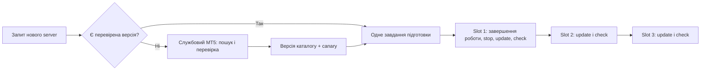

**Автоматичне додавання брокерських серверів у пул MT5**

Дата: 10 вересня 2026. Статус: уточнений дизайн; автоматичний discovery та перенесення каталогу між slots ще не перевірені на живому MT5. Успішний тест одного MetaQuotes-Demo account не доводить роботу цього механізму.

**Пізніша перевірка того самого дня:** позитивну інвентаризацію через Server ComboBox, перенесення каталогу на другу копію того самого build/Windows-користувача та приймання звітів Python-агента в Nest уже перевірено локально. Автоматичний discovery/updater і сумісність перенесення між builds ще не підтверджені. [Поточний стан і протокол агента](node-agent.uk.md).

**Оновлення:** незалежний каталог MTAPI повернув той самий набір 19 серверів для Blu, що й наданий приклад конкурента, плюс адреси підключення. Додано й перевірено name-only provider adapter. Для пошуку назв/адрес він стає основним кандидатом замість GUI; описаний нижче GUI-шлях залишається резервним для реєстрації в desktop. Пошук не дорівнює provisioning. [Докази та межі інтеграції](broker-directory-research.uk.md).

**Що автоматизуємо**

Адміністратору не потрібно вручну повторювати додавання брокера в кожному терміналі. TradeTrack підтримує центральний каталог exact server names; агент готує потрібні сервери в кожному slot. Додавання нового broker/server і розповсюдження вже підготовленого каталогу — окремі операції.

Штатний MT5 дозволяє шукати брокера за назвою або адресою в майстрі Open an Account. Після пошуку можна вибрати існуючий рахунок; створювати нові demo accounts для самого discovery не потрібно. У документованому Python API немає окремого `add_server` або `search_brokers`. Тому автоматизація першого discovery потребує керованого пошуку в UI або встановленого офіційного дистрибутива брокера. Обидва шляхи перевіряються окремо. [Пошук брокера](https://www.metatrader5.com/en/terminal/help/startworking/acc_open), [Python API](https://www.mql5.com/en/docs/python_metatrader5).

**Пропонований процес**

1. UI користувача пропонує брокера й точні сервери з центрального каталогу. Історичні назви з нашої БД мають статус observed, поки не пройшли перевірку; назва пропфірми не визначає єдиний server.
2. Якщо server уже доступний у ready slot, job одразу потрапляє до нього. Кожен sync не запускає discovery заново.
3. Якщо server відомий каталогу, але відсутній у поточних slots, агент ставить одну maintenance-job. Повторні запити на той самий server приєднуються до неї.
4. Для нового server тимчасова службова копія MT5 виконує штатний пошук брокера з очікуванням результату. UI automation працює лише з підтвердженим PID/window і перевіряє текст/стан контролів; немає введення credentials чи натискань за фіксованими координатами. Не знаходить однозначний результат — статус needs_review без спроб вгадати endpoint.
5. Отриманий список перевіряється. Доступність endpoint, наявність у UI та успішна авторизація — різні ознаки; лише остання підтверджує можливість читати конкретний рахунок. Credential не передається довільним серверам, запропонованим неперевіреним текстом.
6. Підготовлений каталог оформлюється як незмінний versioned artifact із hash, terminal build, точним списком endpoint і результатами перевірок. Активація після canary на одному чистому slot.
7. Supervisor по черзі припиняє видачу jobs одному slot, чекає завершення його роботи, повністю зупиняє власний terminal process і встановлює нову версію. Після запуску перевіряє каталог, identity/path та readiness і повертає slot у пул. Решта терміналів продовжують синхронізацію.

**Як переносити список між терміналами**

Перший кандидат — копіювання цілого підготовленого `Config/servers.dat` із чистої службової копії у зупинений slot того самого перевіреного build. Це експериментальний механізм розгортання, не документований MetaQuotes API імпорту каталогу. Не парсити й не дописувати власноруч записи в недокументований бінарний формат; не об'єднувати файли байтами.

До використання перевірити, чи достатньо цього файлу, чи він переноситься між Windows-користувачами, чи зміна build не ламає формат, і чи всі попередні брокери лишаються доступними після заміни. Вихідний шаблон готується без рахунків/паролів; довільні profiles, accounts.dat, certificates і налаштування AI не копіюються.

Якщо цей шлях нестабільний, запасний варіант — відтворювати перевірений broker discovery у кожному вільному slot або готувати окремі шаблони за брокерським дистрибутивом. Новий сервер отримує лише сумісні slots, а scheduler враховує їхні capabilities. Завжди перевіряти фактичний результат, а не тільки наявність файлу.

Кожен запущений термінал має власний файл каталогу й data directory. Спільний живий `servers.dat` через symlink/shared folder не використовуємо: кілька процесів могли б перезаписувати його одночасно. Перед заміною потрібні exclusive slot lock і підтверджений вихід terminal.exe; `mt5.shutdown()` цього не гарантує. [Окремі каталоги терміналів і portable mode](https://www.metatrader5.com/en/terminal/help/start_advanced/start).

**Центральна БД і наявність сервера в кожному терміналі**

Уточнення від 10 вересня 2026: користувач погодив центральне зберігання назв брокерів/серверів та облік їхньої наявності у кількох MT5 на Windows VPS. Таблиці вже реалізовано у Next.js-проєкті `traders-notetaker` (моделі з префіксом `Mt5`); міграцію `20260910163125_mt5_server_catalogue_and_terminal_inventory` застосовано лише в окремій локальній тестовій БД. CLI `import:mt5-catalogue` імпортував 152 сервери / 95 брокерів із двох наданих JSON; повторний імпорт не створив дублікатів. Інструкція: `traders-notetaker/prisma/mt5-catalogue.md`. Звітування агента, перевірка фактичної наявності у desktop і UI ще не реалізовані. Нижче збережено дизайн та наступні етапи.

У перевіреній `traders-notetaker/prisma/schema.prisma` модель `TradingAccount` уже має `terminalServer`, `propCompanyName`, `terminalSyncState` та окремий зв'язок із credentials. Рядок `terminalServer` описує вибір для рахунку; він не є інвентарем терміналів. Пропоновані сутності в спільній PostgreSQL:

| Сутність | Що зберігає |
| --- | --- |
| Broker | Стабільний ID, офіційна назва компанії, окремі пошукові aliases. Пропфірма може використовувати іншу брокерську компанію; автоматично прирівнювати їх не можна. |
| BrokerServer | Broker ID, платформа MT5, точна назва сервера для login, стан перевірки/архівації. Унікальність за broker + platform + exact name; назви з різних компаній не зливати автоматично. |
| ServerObservation | Джерело, час отримання, вихідна назва компанії/сервера, необов'язкові адреси та оцінка джерела. `confidence: 100` із чужої відповіді не означає успішний login. Адреси — кандидати, що потребують перевірки перед використанням. |
| Mt5Node | Стабільний ID Windows-вузла, назва, версія агента, останній heartbeat, адміністративний стан. |
| Mt5TerminalSlot | Node ID, стабільний slot ID, ідентичність exe/data directory, поточний PID і покоління запуску, build, стан процесу, бажана й застосована версія каталогу. Один slot — один ізольований термінал; PID не є постійним ID. |
| TerminalServerState | Унікальна пара slot ID + server ID, спостережена наявність, метод і час перевірки, покоління запуску, hash каталогу, окремий стан підготовки та безпечний код помилки. |

Наявність має значення `unknown`, `present`, `absent`. Стан підготовки окремий: `pending`, `applying`, `applied`, `failed`; копіювання файлу саме по собі не встановлює `present`. Відсутність рядка в БД означає `unknown`. `absent` дозволений лише після повної успішної перевірки відповідного списку; timeout або частковий результат не доводять відсутності.

Агент працює з налаштованими, вже запущеними терміналами. Він надсилає звіти через автентифікований backend, без прямого доступу Windows до БД. Backend обмежує звіт slots цього вузла та відкидає запізнілі звіти старого покоління/порядкового номера. Повторне надсилання одного звіту не створює дублікати. Зникнення heartbeat, зміна build, data directory чи каталогу робить попередню перевірку застарілою; старі докази зберігаються, але scheduler не трактує їх як поточну готовність.

В офіційному Python API немає функції переліку зареєстрованих брокерських серверів. Тому спочатку потрібен перевірений механізм інвентаризації desktop-каталогу: штатний UI або окремо валідований читач формату. Manifest/hash показує, який файл встановлено, але не замінює перевірку, що цей build MT5 бачить потрібний сервер. До підтвердження механізму агент чесно повертає `unknown`. [Список функцій Python API](https://www.mql5.com/en/docs/python_metatrader5).

Успішний investor login та читання даних зберігаються як результат конкретного account sync з часом, account/server/slot identity. Вони не гарантують доступність для всіх рахунків брокера. Помилка пароля одного користувача не переводить сервер глобально в `absent`.

Адміністратор бачить матрицю «сервер × термінал» із часом останньої перевірки. Звичайний користувач бачить брокера, точну назву сервера та зрозумілий стан підключення; шляхи Windows, endpoints та дані чужих рахунків не повертаються в пошук. Credentials залишаються поза каталогом. Пошук UI читає наш каталог; недоступність зовнішнього джерела не прибирає вже збережені результати.

Послідовність реалізації:

1. Додати моделі та індекси через Prisma у головному `traders-notetaker`, який володіє міграціями; перевірити на окремій development БД. У `tradetrack-api` оновити vendored schema та згенерувати клієнт. Python не створює паралельну схему БД.
2. Зробити повторюваний імпорт наданих JSON і результатів незалежного provider adapter із джерелом та датою. Не імпортувати API keys/Bearer. Точні дублікати об'єднувати, суперечності відправляти на перегляд. Відсутність сервера в одному пошуку не є підставою видалення.
3. Додати необов'язковий `brokerServerId` до рахунку, зберігши старий `terminalServer` для сумісності. Зв'язувати лише однозначні записи; пропфірма чи збіг тексту серед різних брокерів не достатні для автоматичної прив'язки.
4. Реалізувати пошук у backend та приймання звітів агента. Перевірити дублікати, прострочені звіти, ізоляцію вузлів і стани після рестарту.
5. Перевірити інвентаризацію та підготовку на двох тестових терміналах. Потім увімкнути матрицю станів і вибір scheduler тільки серед здорових сумісних slots із чинними доказами готовності.

Центральний каталог може містити більше серверів, ніж встановлено на VPS. Спершу готуємо потрібні користувачам сервери та резервні slots для них; немає потреби одразу поширювати весь зовнішній довідник на кожен термінал.

**Конкуренція та відмови**

- Одночасні запити одного broker/server об'єднуються; один updater володіє конкретним slot.
- Не замінювати каталог під час login/history/positions. При drain timeout відкласти оновлення, а не зірвати job лише заради нового каталогу.
- Artifact містить накопичений перевірений набір серверів для свого сімейства; додавання одного не повинно прибрати попередні. Стару версію можна відновити, якщо startup/canary не пройшли.
- Після crash посеред оновлення slot залишається неготовим, доки manifest/hash і перевірка термінала не узгодяться. Позначка database-ready без живої перевірки недостатня.
- Якщо залишився один здоровий slot, не зупиняти його для планового оновлення без контрольованого maintenance-вікна. За можливості готувати replacement slot і лише потім перемикати роботу.
- Невідомий брокер, неоднозначний server, непідтримуваний build або обмеження брокера не повинні породжувати нескінченні спроби входу. Користувач бачить «готуємо підключення» або «потрібне уточнення сервера».
- Шукати компанію та готувати шаблон можна без investor password. Перевірку конкретного рахунку виконувати пізніше лише в session worker з чинною lease.

**Наступна практична перевірка перед реалізацією поширення**

На двох окремих тестових slots одного build: додати через штатний пошук MetaQuotes і одного цільового брокера (наприклад, FTMO або FundedNext), зупинити builder, перенести лише кандидатний каталог і перевірити точні сервери після restart. Для доступного MetaQuotes-Demo перевірити Python login на обох slots послідовно. Для іншого брокера без тестового account підтверджувати лише видимість каталогу, не робоче підключення.

Потім перевірити, що slot 1 можна оновити, поки slot 2 працює, і що попередня версія відновлюється після невдалого оновлення. Лише після цього реалізовувати production updater. Самі broker names із БД не є готовим servers.dat.
